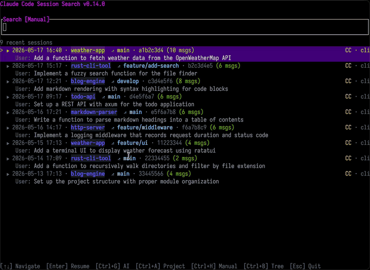

# ccs

Search, inspect, and resume local Claude Code, Claude Desktop, and Codex sessions from the terminal.

Use `ccs` when you remember a topic, command, file path, stack trace, or decision from an old agent session, but not the session itself.



## Install

The package is named `ccfullsearch`; the installed command is `ccs`.

Homebrew:

```bash
brew install materkey/ccs/ccs
```

Shell installer:

```bash
curl --proto '=https' --tlsv1.2 -LsSf https://github.com/materkey/ccfullsearch/releases/latest/download/ccfullsearch-installer.sh | sh
```

Cargo:

```bash
cargo install ccfullsearch --locked
```

cargo-binstall:

```bash
cargo binstall ccfullsearch
```

Requirements:

- `rg` from [ripgrep](https://github.com/BurntSushi/ripgrep) must be available in `PATH`. The Homebrew formula installs it automatically.
- `claude` must be available in `PATH` to resume Claude Code sessions and to use AI ranking.
- `codex` must be available in `PATH` to resume Codex sessions.

## Quick start

Open the TUI:

```bash
ccs
```

Start typing to search. Press `Enter` to resume the selected session.

Search from the CLI:

```bash
ccs search "docker build" --limit 10
ccs search "OOM|OutOfMemory" --regex --limit 20
```

List recent sessions:

```bash
ccs list --limit 20
```

Pick a session for a script:

```bash
ccs pick "docker"
```

Keep the picker open after resuming a session:

```bash
ccs --overlay
```

Open the tree view directly:

```bash
ccs --tree <session-id-or-path>
```

Resume from a specific message UUID:

```bash
ccs --overlay --tree /path/to/session.jsonl --resume-uuid <message-uuid>
```

Update a non-Homebrew install:

```bash
ccs update
```

For Homebrew installs, use `brew upgrade ccs` instead.

## What it searches

`ccs` reads local JSONL transcripts. By default it uses the session roots that exist on your machine:

- Claude Code CLI: `~/.claude/projects/`
- Claude Code CLI with a custom config directory: `$CLAUDE_CONFIG_DIR/projects/`
- Codex: `~/.codex/sessions/` and `~/.codex/archived_sessions/`
- Codex with a custom home: `$CODEX_HOME/sessions/` and `$CODEX_HOME/archived_sessions/`
- Claude Desktop on macOS: `~/Library/Application Support/Claude/local-agent-mode-sessions/`
- Claude Desktop on Linux: `~/.config/Claude/local-agent-mode-sessions/`

To replace the default roots with one custom directory:

```bash
CCFS_SEARCH_PATH=/custom/sessions/dir ccs
```

## What gets indexed

`ccs` searches across transcript content and useful session metadata:

- user and assistant messages;
- tool calls and tool results;
- thinking blocks;
- image, document, and attachment references;
- rendered slash commands;
- project, branch, provider, source, timestamp, and message count metadata.

Results are grouped by transcript, so multiple matches from the same conversation stay together.

## TUI

`ccs` opens on recent sessions. Type anything to switch into search mode.

Main keys:

- `Up` / `Down`: move through sessions or messages.
- `Enter`: resume the selected session or selected tree message.
- `Tab` / `Ctrl+V`: show or hide the preview pane.
- `Ctrl+B`: open the conversation tree.
- `Ctrl+A`: toggle current-project filtering.
- `Ctrl+H`: switch between manual, automated, and all sessions.
- `Ctrl+R`: toggle regex search.
- `Ctrl+G`: rank visible sessions with the `claude` CLI.
- `Ctrl+C`: clear the current query, or quit when the query is empty.
- `Esc`: close preview or quit.

Text editing also supports `Home`, `End` / `Ctrl+E`, `Delete`, `Ctrl+W`, `Alt+Backspace`, `Alt+D`, `Alt+B` / `Alt+Left`, `Alt+F` / `Alt+Right`, and `Ctrl+Left` / `Ctrl+Right`.

### Tree view

Tree view shows conversation branches, fork points, latest-chain markers, and compaction boundaries.

For Claude Code sessions, resuming from a non-latest tree message creates a forked JSONL transcript and resumes that branch. This lets you continue from the exact point you selected instead of the latest leaf.

Useful keys in tree view:

- `Left` / `Right`: jump to the previous or next branch point.
- `Tab`: toggle message preview.
- `Enter`: resume from the selected message.
- `Ctrl+C`, `b`, or `Esc`: return to search.
- `q`: quit.

### AI ranking

Press `Ctrl+G` to enter AI ranking mode. Type a natural-language query, then press `Enter`.

`ccs` sends the visible session candidates to `claude -p` with compact context: session ID, project, summary, and up to three early user messages from each session. The response is parsed as a ranked list of session IDs.

## CLI

`ccs search` writes JSONL, one object per matching message.

Fields:

- `session_id`: session UUID or provider-specific session ID.
- `project`: project name extracted from the transcript path or metadata.
- `provider`: transcript owner, for example `Claude` or `Codex`.
- `source`: session source, for example `CLI` or `Desktop`.
- `file_path`: full path to the JSONL transcript.
- `timestamp`: message timestamp in RFC 3339 format.
- `role`: message role.
- `content`: extracted searchable content.

Example:

```bash
ccs search "connection pool timeout" --regex --limit 10
```

`ccs list` writes JSONL, one object per recent session.

Fields:

- `session_id`
- `project`
- `provider`
- `source`
- `file_path`
- `last_active`
- `message_count`

Example:

```bash
ccs list --limit 20
```

## Picker mode

`ccs pick` opens the same TUI, but prints the selected session as key-value output. It exits with code `0` after a selection and `1` on cancel.

```bash
ccs pick
ccs pick "docker"
ccs pick --output /tmp/session.txt
```

Example output:

```text
session_id: abc-123
file_path: /path/to/session.jsonl
source: CLI
project: my-project
message_uuid: def-456
```

`message_uuid` is included when the selected row maps to a concrete message, such as a search result or tree selection.

## Overlay mode

```bash
ccs --overlay
```

Overlay mode resumes the selected session as a child process. When the resumed tool exits, `ccs` returns to the picker and restores the current search query.

This is useful when you want to review or resume several related sessions without relaunching the picker each time.

## Claude Code plugin

The repository includes a Claude Code plugin in `.claude-plugin/` and a `ccs` skill in `.claude/skills/ccs/`.

The skill supports:

- CLI mode through `ccs search` and `ccs list`.
- Overlay picker mode through `.claude/skills/ccs/scripts/launch-ccs.sh`.
- Overlay resume through `.claude/skills/ccs/scripts/launch-resume.sh`.

With the plugin installed, Claude Code can use `ccs` for requests such as:

- find where a topic was discussed;
- list recent sessions;
- resume a previous conversation.

## Development

```bash
cargo fmt --check
cargo clippy --all-targets --all-features -- -D warnings
cargo test
```

Useful docs:

- [Use cases](docs/use-cases.md)
- [Changelog](CHANGELOG.md)

## Release

1. Bump `version` in `Cargo.toml`.
2. Update `CHANGELOG.md`.
3. Commit and push to `main`.
4. Publish to crates.io:

   ```bash
   cargo publish
   ```

5. Tag and push:

   ```bash
   git tag v<VERSION>
   git push origin v<VERSION>
   ```

The tag push triggers cargo-dist, which builds release archives, shell installers, checksums, a GitHub Release, and the Homebrew formula in `materkey/homebrew-ccs`.

## License

MIT
